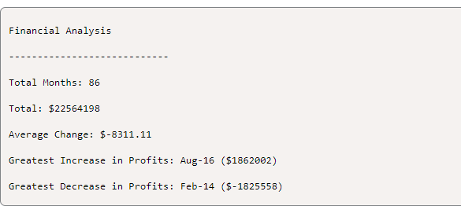
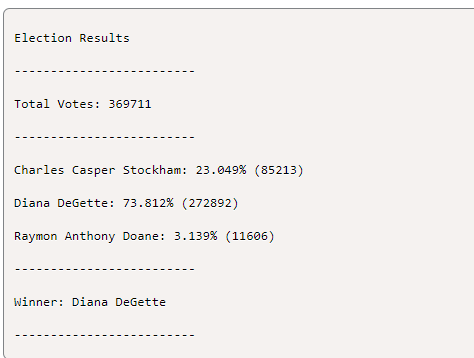

# python-challenge

## Background
It's time to put away the Excel sheet and enter the world of programming with Python. In this assignment, you'll use the concepts you've learned to complete two Python challenges, PyBank and PyPoll. Both tasks present a real-world situation where your newly developed Python scripting skills come in handy.

## Files
Download the following files to help you get started:
https://static.bc-edx.com/data/dl-1-2/m3/lms/starter/Starter_Code.zip

## PyBank Instructions
* In this Challenge, you are tasked with creating a Python script to analyze the financial records of your company. You will be given a financial dataset called budget_data.csv. The dataset is composed of two columns: "Date" and "Profit/Losses".

* Your task is to create a Python script that analyzes the records to calculate each of the following values:

* The total number of months included in the dataset

* The net total amount of "Profit/Losses" over the entire period

* The changes in "Profit/Losses" over the entire period, and then the average of those changes

* The greatest increase in profits (date and amount) over the entire period

* The greatest decrease in profits (date and amount) over the entire period

* Your analysis should align with the following results:

* In addition, your final script should both print the analysis to the terminal and export a text file with the results.

The result should match the following image:

## PyPoll Instructions
* In this Challenge, you are tasked with helping a small, rural town modernize its vote-counting process.

* You will be given a set of poll data called election_data.csv. The dataset is composed of three columns: "Voter ID", "County", and "Candidate". Your task is to create a Python script that analyzes the votes and calculates each of the following values:

* The total number of votes cast

* A complete list of candidates who received votes

* The percentage of votes each candidate won

* The total number of votes each candidate won

* The winner of the election based on popular vote

* In addition, your final script should both print the analysis to the terminal and export a text file with the results.

The result should match the following image:

## Other Considerations
* Consider what you've learned so far. You've learned how to import modules like csv. You’ve learned how to read and write files in various formats. You’ve learned how to store content in variables, lists, and dictionaries. You’ve learned how to iterate through basic data structures. And you’ve learned how to debug along the way. Using all that you've learned, try to break down your tasks into discrete mini-objectives.

* The datasets for these Challenges are quite large. This was done purposefully to showcase one of the limits of Excel-based analysis. As data analysts, our first instinct is often to go straight to Excel, but creating scripts in Python can provide us with more powerful options for handling big data.

* Write one script for each of the provided datasets. Run each script separately to make sure that the code works for its respective dataset.

* Always commit your work and back it up with pushes to GitHub or GitLab. You don't want to lose hours of your hard work! Also make sure that your repo has a detailed README.md file.

## Submission
To submit your Challenge assignment, click Submit, and then provide the URL of your GitHub repository for grading.

### References
Data for this dataset was generated by edX Boot Camps LLC, and is intended for educational purposes only.